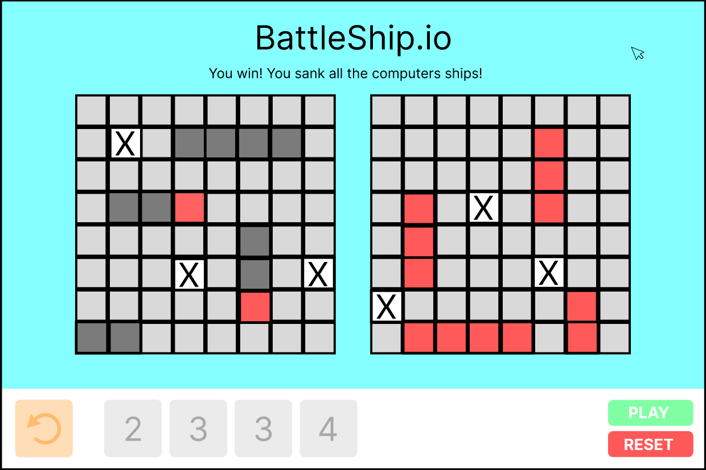
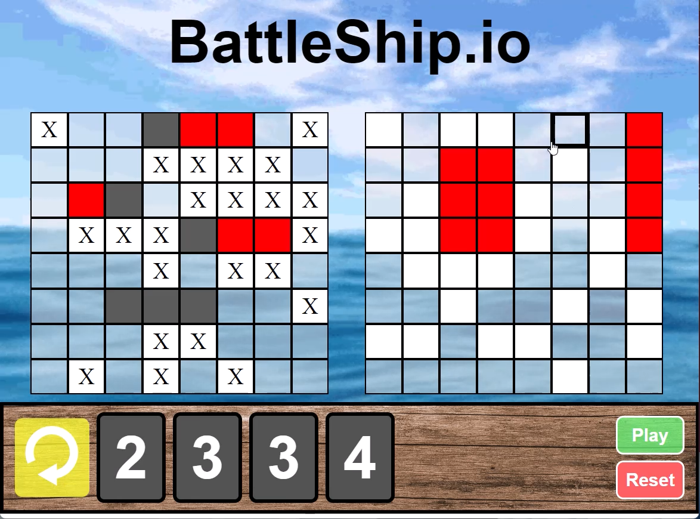

# Battleship

## Description
This is a simple battleship game that can be played in the browser. The game is played by one player. The boards are 8x8 grids. The player has 4 ships of different lengths. The ships are placed on the board by the player. The player take turns guessing where the computers ships are. The first player to sink all of the ships wins.

## Technologies Used
* HTML
* CSS
* JavaScript

## Getting Started
[Click here](https://battleship-shalomgman.netlify.app/) to play the game.

## Next Steps
* Fix Bugs
* Add an AI opponent

## Screenshots



## Code Examples
```javascript
function checkForWin() {
  if (playerShipsSunk === 4) {
    alert('You win!');
    resetGame();
  } else if (computerShipsSunk === 4) {
    alert('You lose!');
    resetGame();
  }
}
```

## Motivation
I wanted to create a game that I could play in the browser. I also wanted to practice using JavaScript to manipulate the DOM.

## Project Management
[Click here](https://malachite-silene-cb6.notion.site/b33cce046a004bb0bcb45df34ffcf784?v=df5ec50bb5c74d9c9773fefac9ac2d6f) to view the Notion board used to manage this project.

## How to Play
1. In the controls section, click on a ship to select it.
2. Click on a square on the board to place the ship.
3. Repeat steps 1 and 2 until all ships are placed.
4. Click on a square on the computer's board to guess where the computer's ships are.
5. Repeat step 4 until all of the computer's ships are sunk.

## Bugs
* The player can place ships on top of each other.
* The player can place ships off the board.
* The player can guess the same square more than once.
* The player can still place ships after the game started.
* The player can still guess after the game is over.
* The computer can somtimes hit your ship and will look like a miss (dont worry, its still concidered a hit).
